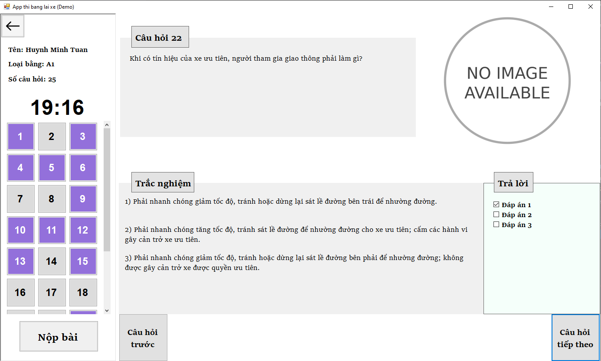

# OOP-Final-Project
Đồ án OOP cuối kì

### Format of data
Tham khảo data của [A1](src/demo_oop/data/A1/data.txt)
```python
N # số câu hỏi
description1 # nội dung câu hỏi thứ 1
n # số đáp án trắc nghiệm
answer1 # đáp án 1
answer2 # đáp án 2
...
answern # đáp án thứ n
m # số đáp án đúng
result1 # đáp án đúng 1 (kiểu int, là index của n câu trả lời trên)
result2 # đáp án đúng 2
...
resultm # đáp án đúng m
nameImage # tên của ảnh (nếu có) không thì để None
description2 # nội dung câu hỏi thứ 2
....
```

### Link to diagram
[online visual paradigm](https://online.visual-paradigm.com/share.jsp?id=313732383838342d31)

### UI/UX
#### Menu User Interface


#### Test Exam User Interface



#### Question database User Interface


#### History User Interface
